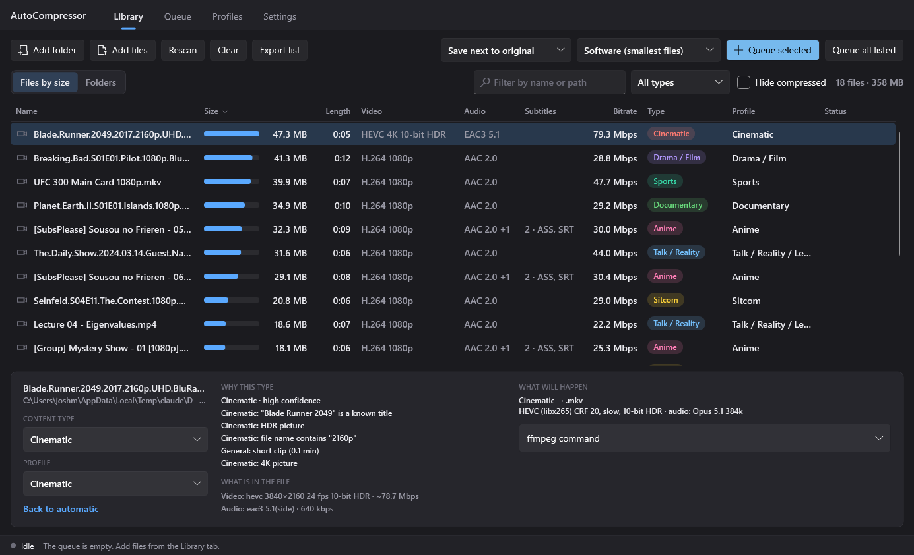

# BlueberryCompressor

A Windows desktop app that finds the video and audio files eating your disk, works out what each one is,
and compresses it with settings suited to that kind of content. It drives **ffmpeg**; everything else is
native .NET (WPF), with no third-party packages.



## What it does

- **Scans** folders recursively (or individual files) and lists every media file **by size**, or as a
  **folder tree** where each folder and file shows its share of its parent.
- **Recognises** content as Anime, Animation, Sitcom, Drama/Film, Cinematic, Documentary, Talk/Reality/Lecture,
  Sports, Concert, General, Music or Speech, and shows the evidence for each decision.
- **Assigns a profile** per type. Animation keeps high picture quality (10-bit HEVC, animation tuning);
  static, talk-heavy shows are reduced hard (720p, 30 fps, low quality target); concerts keep their audio untouched.
- **Carries subtitles over in their original format** (ASS stays ASS, SRT stays SRT, PGS stays PGS), with fonts, chapters and track
  languages. Where a container cannot hold a format, the track is written beside the file in its original format.
- **Estimates the size after compression** for every file and folder (the "After (est.)" column), from the profile's
  quality target, resolution, frame rate and content type. It is a rule of thumb; for one file, **Measure** test-encodes
  a few short samples with the exact settings and gives a far more reliable figure.
- **Queue** like HandBrake's: add files or whole folders, reorder, pause, stop, resume next session. Optional
  quiet-hours schedule and parallel jobs.
- **Software and hardware encoders**: x264, x265, SVT-AV1/libaom, NVIDIA NVENC, AMD AMF, Intel Quick Sync, detected by
  actually test-running each one.
- **Replace** the original, save **next to** it, or write to a **separate folder**.
- **Swap in compressed copies later**: after compressing next to the originals and checking the results, one button on
  the Queue tab removes the originals and renames each copy to the original's name.
- **Fetches missing subtitles** from open databases (Gestdown, OpenSubtitles) when asked to.

## Running it

Requirements: Windows 10/11, the [.NET 9 Desktop Runtime](https://dotnet.microsoft.com/download/dotnet/9.0), and ffmpeg
with ffprobe (`winget install Gyan.FFmpeg`). ffmpeg is found on `PATH` automatically, or set its location in Settings.

```
build.cmd
publish\AutoCompressor.exe
```

`build.cmd` needs the .NET 9 SDK and produces a single `AutoCompressor.exe`.

## How content is recognised

Each file collects weighted evidence; the type with the most wins, and anything without real evidence stays
**General** and is flagged with a `?` rather than guessed at.

| Evidence | Examples |
| --- | --- |
| Folder names | `Anime`, `Sitcoms`, `Documentaries`, `Lectures`, `Sports`, `Concerts`, `Podcasts` anywhere in the path |
| File name | Fansub naming (`[Group] Title - 05 [CRC]`), dated episodes (daily shows), `UFC`, `Live at`, camera file names |
| Streams | Japanese audio, styled ASS subtitles with fonts, HDR/4K, 50/60 fps, interlacing, lossless surround, duration |
| Embedded tags | Genre tags in the file |
| Known titles | A built-in list of several hundred well-known shows and films |
| Online lookup (optional) | TVMaze for series (no key), TMDB for films (your key). Only the parsed title is sent, once per show |
| Neighbours | Episodes in one folder follow the majority when their own evidence is weak |

Online lookup is **off by default**; turn it on in Settings for the best results on anything not in the built-in list.
You can always override the type or profile of any selection, and the choice is remembered.

## Profiles

| Profile | Video | Audio | Priority |
| --- | --- | --- | --- |
| Anime | HEVC 10-bit, CRF 19, slow, animation tune | Opus, all tracks kept | Picture: clean lines, no banding |
| Animation | HEVC 10-bit, CRF 21, slow, animation tune | Opus | Picture |
| Sitcom | HEVC, CRF 26, max 1080p/30 fps | Opus stereo 96k | Small files, clear dialogue |
| Drama / Film | HEVC, CRF 23, max 1080p | Opus, surround kept | Balanced |
| Cinematic | HEVC, CRF 20, slow, 4K and HDR kept | Opus up to 7.1 at high bitrates | Picture and sound |
| Documentary | HEVC, CRF 22 | Opus | Picture detail |
| Talk / Reality / Lecture | HEVC 8-bit, CRF 28, max 720p/30 fps | Opus stereo 80k | Smallest; speech stays clear |
| Sports | HEVC, CRF 23, original frame rate kept | Opus | Motion |
| Concert / Music video | HEVC, CRF 23 | Copied untouched | Sound |
| General | HEVC, CRF 24 | Opus | Safe middle |
| Compatibility | H.264 + AAC in MP4 | AAC | Plays anywhere (not auto-assigned) |
| AV1 | AV1 10-bit | Opus | Smallest, slow in software (not auto-assigned) |
| Music | AAC `.m4a`; lossless sources become FLAC | | Keeps cover art |
| Music (Opus) | Opus `.opus` | | Smallest (no cover art) |
| Music (AAC 256), (Opus 192) | Higher-quality lossy from lossless sources | | Not auto-assigned |
| Music (MP3 320), (MP3 192) | MP3 `.mp3` with cover art and tags | | Plays on everything; not auto-assigned |
| Music (FLAC) | Lossless only: WAV/AIFF/ALAC to FLAC | | Not auto-assigned |
| Speech | Opus mono 40k | | Podcasts, audiobooks |

Every value is editable on the Profiles tab: container, codec, encoder kind, rate control, quality, bitrate and ceiling,
speed, tune, bit depth, resolution and frame-rate limits, deinterlacing, denoise, raw encoder parameters, audio codec and
per-layout bitrates, channel limit, track languages, subtitle handling, and the "already small enough" threshold.
Built-in profiles can be edited and reset; you can add your own and change which profile each content type gets.

Profiles are written in software-encoder quality units (CRF). When a GPU encoder is used, the profile's
*hardware quality offset* is added, because those encoders' scales run lower for a comparable result.

## Safety

Compression is lossy, so the app is careful about originals:

- The default output mode keeps the original and writes `name.compressed.ext` beside it.
- Output is written to a temporary file. Only after it has been verified (readable, same duration, the expected number
  of video, audio and subtitle streams) is anything done to the original.
- In **Replace** mode the original goes to the Recycle Bin by default; a backup folder or permanent deletion are options.
- If the result is not at least 10% smaller (configurable), it is discarded and the original is left alone.
- Files already efficient for their resolution are skipped up front. Files the app produced are tagged and never
  compressed twice. Nothing is ever overwritten: name clashes get ` (2)`.
- HDR stays 10-bit with its colour tags; an encoder that cannot do 10-bit is never used for it. Dolby Vision files are
  skipped by default because re-encoding drops the Dolby Vision layer.
- A lossy audio track already at or under the target bitrate is copied rather than re-encoded.

## Subtitles from online databases

Off by default (Settings → Missing subtitles). When enabled, a file lacking subtitles in your chosen languages is looked
up at encode time and the result is added as a track or saved as `.srt` beside the file.

- **Gestdown**: open-source service over the Addic7ed community database. TV episodes only, no account.
- **OpenSubtitles.com**: films and series, matched by file hash where possible. Needs your own free API key and login.
  The password is stored encrypted for your Windows account.

## Data

Settings, custom profiles, the queue, caches and per-job ffmpeg logs live in `%LOCALAPPDATA%\AutoCompressor`.

## Development

```
dotnet build
tests\AutoCompressor.Tests\bin\Debug\net9.0-windows\AutoCompressor.Tests.exe [--online] [--recycle] [--only <section>]
```

The test program generates its own sample media with ffmpeg and runs real encodes: subtitle preservation, MP4
fallbacks, scaling and frame-rate halving, each hardware encoder present, HDR passthrough, skip rules, replace mode
(including name clashes and locked originals), audio files, and the queue (pause, stop, removal, schedule, parallel jobs).
`--online` adds live TVMaze and Gestdown checks; `--recycle` sends one small test file through the Recycle Bin.

The app has developer switches: `--data-dir <dir>` uses a separate settings folder, `--scan <folder>` opens with a folder
loaded, `--screenshot <dir>` renders each tab to PNG (`--demo-run` also runs the queue), and `--self-test <file>` runs a
scripted walk through the UI's view models, including a real replace-mode run on the scanned folder.

```
src/AutoCompressor.Core      scanning, probing, recognition, profiles, ffmpeg command building, queue, subtitles
src/AutoCompressor.Desktop   WPF app (views, view models)
tests/AutoCompressor.Tests   end-to-end tests
```

## Known limits

- Tested with generated sample media, not a real library. Try a few files in "next to original" mode and look at the
  results before switching to Replace.
- Picture-based subtitles (PGS, VobSub) are stream-copied like the others, but no sample was available to test with.
- Intel Quick Sync and AMD AV1 encoding are implemented but could not be run on the development machine.
- The OpenSubtitles and TMDB integrations need your own keys and were only tested up to the point of being rejected
  without one.
- With ffmpeg 7.0, GPU encoders keep HDR colour tags but not HDR10 mastering metadata (the software HEVC encoder keeps
  both), and AMD's HEVC encoder is 8-bit only. The app detects and reports both.
- Quality equivalence between software CRF and hardware quality values is approximate; adjust the offset per profile.
